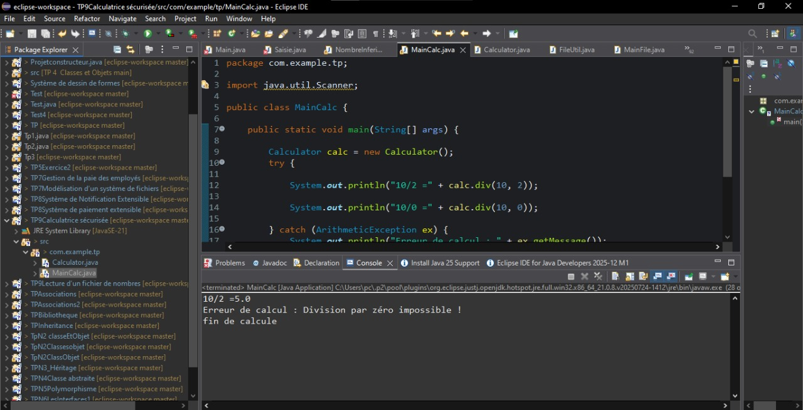
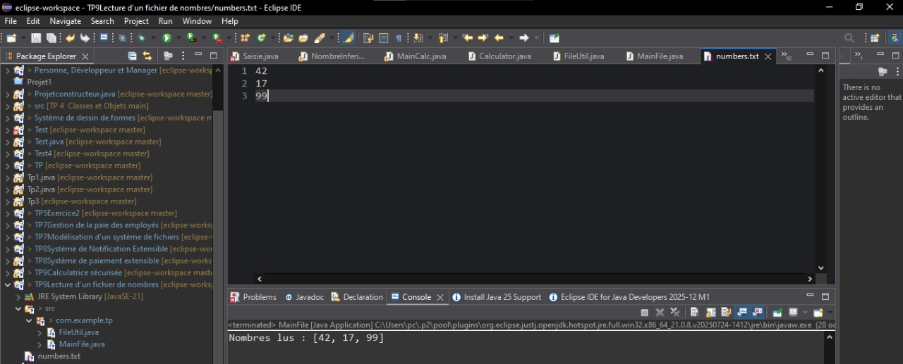
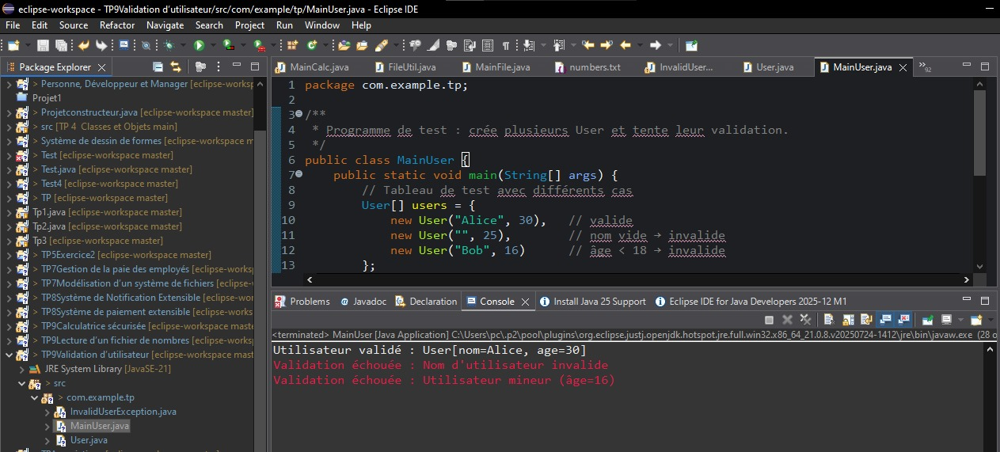
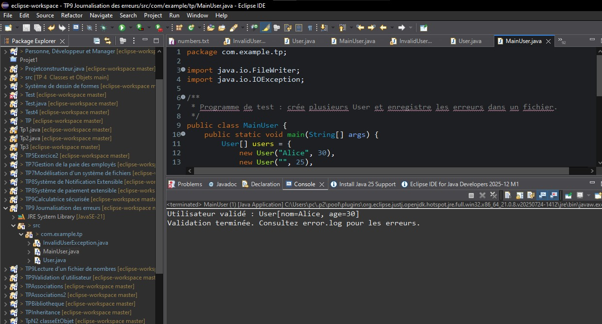

# TP9 — Gestion des Exceptions et Fichiers en Java

##  Objectif général
Ce TP a pour but de maîtriser la **gestion des exceptions**, la **création d’exceptions personnalisées**, et l’**utilisation des flux d’E/S** (lecture et écriture de fichiers) en Java.

---

##  Exercice 1 — Calculatrice sécurisée
### Objectif
Illustrer la gestion des exceptions en implémentant une classe `Calculator` capable d’effectuer les opérations de base, avec détection d’erreurs comme la **division par zéro**.

### Structure
```` bach
src/com/example/tp/
├─ Calculator.java
└─ MainCalc.java
````

### Résumé
- `Calculator` contient `add`, `sub`, `mul`, `div`.
- `div` lève une `ArithmeticException` si le diviseur est nul.
- `MainCalc` gère cette erreur via `try–catch–finally`.

### Résultat visuel
<div align="center">  <p><em>Figure 1</em></p> </div>

##  Exercice 2 — Lecture d’un fichier de nombres
### Objectif
Lire un fichier texte (`numbers.txt`), convertir son contenu en entiers, et gérer les exceptions liées à la lecture (`IOException`) et au format (`NumberFormatException`).

### Structure
````bash
src/com/example/tp/
├─ FileUtil.java
└─ MainFile.java
numbers.txt
````


### Fonctionnalités
- Lecture ligne par ligne avec `BufferedReader`.
- Ignorer les lignes vides ou les commentaires (`#`, `//`).
- Comptage des lignes invalides.
- Calcul des statistiques (somme, min, max, moyenne).
  ### Résultat visuel
<div align="center">  <p><em>Figure 2</em></p> </div>

##  Exercice 3 — Validation d’utilisateur
### Objectif
Apprendre à définir et lancer des **exceptions personnalisées** pour valider un objet `User`.

### Structure
````BASH
src/com/example/tp/
├─ InvalidUserException.java
├─ User.java
└─ MainUser.java
````
### Résumé
- `User` contient `nom` et `âge`.
- `validate()` lève `InvalidUserException` si :
  - le nom est vide ou nul,
  - l’âge < 18 ans.
- `MainUser` teste plusieurs utilisateurs.
 ### Résultat visuel
<div align="center">  <p><em>Figure 3</em></p> </div>

##  Exercice 4 — Journalisation des erreurs
### Objectif
Remplacer l’affichage des erreurs (`System.err`) par une **écriture dans un fichier** `error.log`, en utilisant `FileWriter` en mode *append* avec `try-with-resources`.

### Structure
src/com/example/tp/
├─ InvalidUserException.java
├─ User.java
└─ MainUser.java

markdown
Copier le code

### Principe
- Même code que l’Exercice 3.
- Dans le `catch`, les erreurs sont écrites dans `error.log`.

### Résultat visuel
<div align="center">  <p><em>Figure 4</em></p> </div>


---

## Concepts couverts dans le TP9
- Exceptions standards (`ArithmeticException`, `IOException`, `NumberFormatException`)
- Exceptions personnalisées (`InvalidUserException`)
- `try–catch–finally` et `try-with-resources`
- Lecture et écriture de fichiers (`FileReader`, `FileWriter`, `BufferedReader`)
- Validation des données et journalisation des erreurs

---
##  Compilation & exécution
Depuis le dossier `src/` :
```bash
javac com/example/tp/*.java
java com.example.tp.MainCalc       
java com.example.tp.MainFile       
java com.example.tp.MainUser
